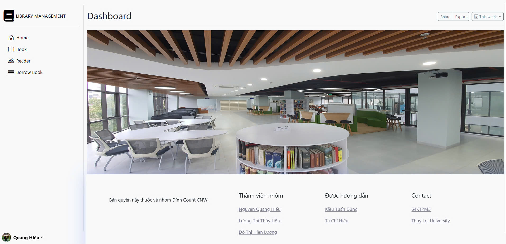
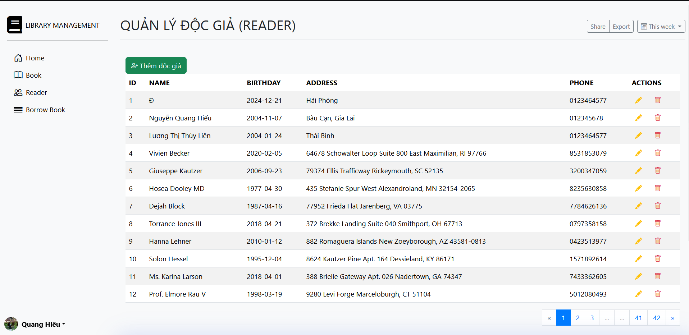
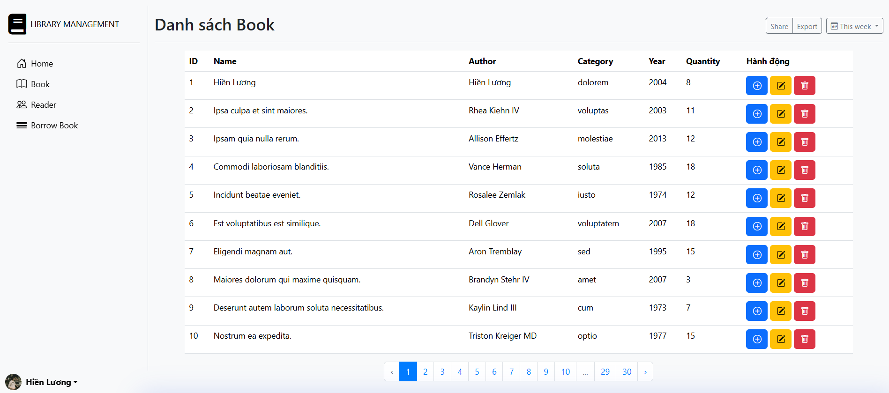

## QUẢN LÝ THƯ VIỆN

1. Quản lý sách: Đỗ Thị Hiền Lương
   o Lưu trữ thông tin sách.Cho phép thêm mới, chỉnh sửa và xóa thông tin sách.
2. Quản lý độc giả: Nguyễn Quang Hiếu
   o Lưu trữ thông tin độc giả. Cho phép thêm mới, chỉnh sửa và xóa thông tin độc giả.
3. Quản lý mượn trả sách: Lương Thị Thùy Liên
   o Ghi nhận thông tin mượn sách.Cập nhật trạng thái trả sách.Cho phép xem lịch sử mượn trả sách của từng độc giả.

## Giao diện ứng dụng

Đây là giao diện chính của quản lý thư viên.

Đây là giao diện chính của quản lý độc giả.

Đây là giao diện chính của quản lý sách.

Đây là giao diện chính của quản lý phiếu mượn.

## Learning Laravel

Laravel has the most extensive and thorough [documentation](https://laravel.com/docs) and video tutorial library of all modern web application frameworks, making it a breeze to get started with the framework.

You may also try the [Laravel Bootcamp](https://bootcamp.laravel.com), where you will be guided through building a modern Laravel application from scratch.

If you don't feel like reading, [Laracasts](https://laracasts.com) can help. Laracasts contains thousands of video tutorials on a range of topics including Laravel, modern PHP, unit testing, and JavaScript. Boost your skills by digging into our comprehensive video library.

## Laravel Sponsors

We would like to extend our thanks to the following sponsors for funding Laravel development. If you are interested in becoming a sponsor, please visit the [Laravel Partners program](https://partners.laravel.com).

### Premium Partners

-   **[Vehikl](https://vehikl.com/)**
-   **[Tighten Co.](https://tighten.co)**
-   **[WebReinvent](https://webreinvent.com/)**
-   **[Kirschbaum Development Group](https://kirschbaumdevelopment.com)**
-   **[64 Robots](https://64robots.com)**
-   **[Curotec](https://www.curotec.com/services/technologies/laravel/)**
-   **[Cyber-Duck](https://cyber-duck.co.uk)**
-   **[DevSquad](https://devsquad.com/hire-laravel-developers)**
-   **[Jump24](https://jump24.co.uk)**
-   **[Redberry](https://redberry.international/laravel/)**
-   **[Active Logic](https://activelogic.com)**
-   **[byte5](https://byte5.de)**
-   **[OP.GG](https://op.gg)**

## Contributing

Thank you for considering contributing to the Laravel framework! The contribution guide can be found in the [Laravel documentation](https://laravel.com/docs/contributions).

## Code of Conduct

In order to ensure that the Laravel community is welcoming to all, please review and abide by the [Code of Conduct](https://laravel.com/docs/contributions#code-of-conduct).

## Security Vulnerabilities

If you discover a security vulnerability within Laravel, please send an e-mail to Taylor Otwell via [taylor@laravel.com](mailto:taylor@laravel.com). All security vulnerabilities will be promptly addressed.

## License

The Laravel framework is open-sourced software licensed under the [MIT license](https://opensource.org/licenses/MIT).
